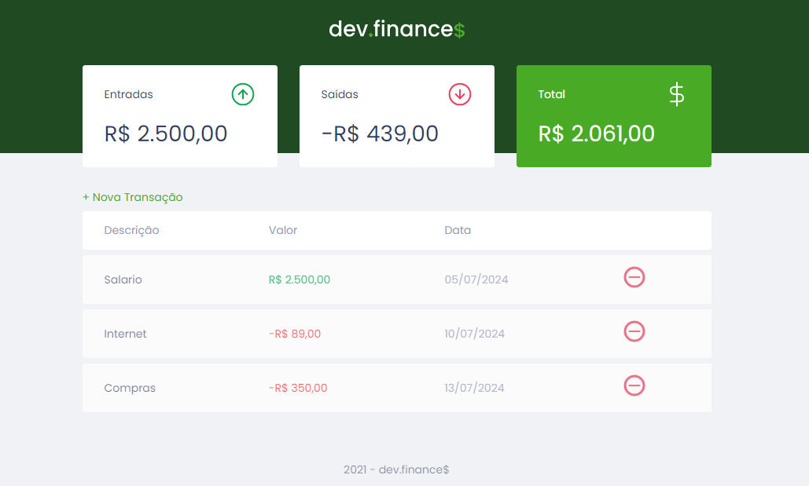

<h1 align="center">dev.finances</h1>

Esse é um projeto da maratona discover da Rocketseat. O dev.finances é uma aplicação de controle financeiro, onde é possível cadastrar e excluir transações e ver o saldo de entrada e saída.

  
  

<a href="#objetivo">Objetivo</a> • <a href="#tecnologias">Tecnologias</a> • <a href="#autor">Autor</a>

 

<a href="https://esther-cardoso.github.io/dev.finances/">Clique aqui para abrir o site</a>

<h2 id="objetivo">Objetivo</h2>

O objetivo desse projeto foi colocar em prática meus conhecimento de HTML, CSS e JavaScript. Aqui eu trabalhei com funções, eventos, pegar valores, operadores.

<h2 id="tecnologias">🛠 Tecnologias</h2>
As seguintes ferramentas foram usadas na construção do projeto:

- HTML
- CSS
- JavaScript

## Autor
<a href="https://www.instagram.com/_esther_cardoso/">
 
  
 <b>Esther Cardoso</b></a>

Feito por Esther Cardoso 👋🏽 Entre em contato!

